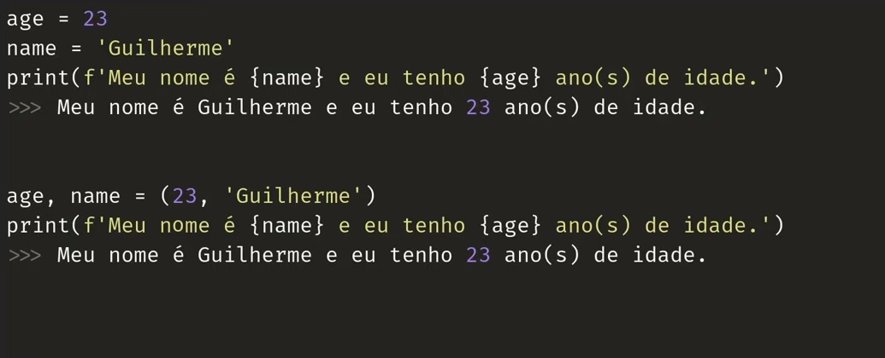

# PYTHON 

Python é uma linguagem de programação criada em 1989. Atualmente está na versão 3.11.
Python é uma linguagem **Multi Plataforma** de **tipagem dinâmica** e **Forte**.

## Primeiro Programa

### AULA 1

Para que o computador realize algo é necessário que que especifiquemos uma sequência de comandos. Isso se assemelha a uma receita de bolo, onde temos os ingredientes e o passo a passo de como deve ser feito

Assim como no caso de uma receita de bolo que precisa estar escrita em algum lugar, seja em um meio físico como um papel, ou em um meio digital, como num arquivo de texto, para escrevermos um programa em Python precisamos armazenar suas instruções em um arquivo virtual. Tal arquivo só se torna um conjunto de instruções Python, ou um programa Python, quando sua extensão é o **.py**.
    
Em Python é necessário que o se coloque entre aspas (”…”) o que deseja que se escreva na tela para o usuário. Por exemplo:  ***print(”Hello Word!”)***.


### AULA 2

#### TIPOS DE DADOS USADOS EM PYTHON

**PARA QUE SERVEM OS TIPOS?**
- Servem para definir as características e comportamentos de um valor (objeto) para o interpretador.
Os tipos built-in são

| DESCRIÇÃO | SINTAX                    |
|-----------|---------------------------|
|Texto      |str                        |
|Numérico   |int, float, complex        |
|Sequência  |list, tuple, renge         |
|Mapa       |dict                       |
|Coleção    |set, fronzenset            |
|Booleano   |bool                       |
|Binário    |byte, bytearray, memoryview|

**TIPOS NUMÉRICOS**

- **Inteiros** {1, 2, 100, -80, -900, 1900, …} que são representados pela classe int e possuem precisão ilimitada.
- **Número de Ponto Flutuante** {1.5, -10.543, 0.76, 999278.002, …} que são representados pela classe float, são usados para representar os números racionais.

**BOOLEANOS E STRINGS**

- ***Booleanos***
    - Representa **Verdadeiro** ou **Falso** e é implementado pela classe ***bool***. Em Python, o tipo booleano é uma subclasse do int, uma vez que *qualquer número diferente de zero representa o valor verdadeiro, e o número zero representa o valor Falso*. São representados pela clesse ***True*** e ***False***.<br>


- ***Strings ou Cadeias de Caracteries***
    - São usadas para representar valores alfa-numéricos, e são representadas pela forma ***str***. São exemplo: “Python”, ‘Python’, “””Python”””, ‘’’Python’’’, “p”.

### AULA 3

#### MODO INTERATIVO


Como usar o modo interativo do interpretador Python?

O interpretador Python pode executar uncomando na hora, possibilitando o desenvolvedor enchergar seu resultado em tempo real.

Há duas maneira de entrar no modo interativo:
1. Chamando o interpretador Python ao digitar o comando `python` no terminal;

2. Executando o script com a flag ***-i*** desse jeito - `python -i app.py` (comando ***python*** + flag ***-i*** + ***a aplicação que deseja executar***).

#### FUNÇÕES DIR E HELP

- DIR
    - Sem argumentos (`dir()`), retorna uma lista de nomes no escopo local atual.
    - Com um argumento (`dir(100)`), retorna uma lista de atributos válidos para o objeto.

- HELP
    - Invoca o sistema de ajuda integrado. É possível fazer buscas em modo interativo ou informar, por parâmetro, qual o nome do módulo, classe, método ou variável.

    > EXEMPLO:
    > - `help()`
    > - `help(100)` <br> <br>

***Quando utilizo o parâmetro 1, 100, eu estou informando que me refiro a totalidade do escopo, ou informação.*** <br> <br>
***Para sair do HELP digita a tecla "Q"***. 

### AULA 4

#### VARIÁVEIS E CONSTANTES

- VARIÁVES são valores que podem sofrer algum tipo de alteração durante a execussão do programa;



- CONSTANTES 

Em python não tem constante.Então, para tornarmos um valor imutável existe convenção, tratado, combinado. no caso da definição de constante em Python existe uma convenção de que toda vez que escrevemos o nome de uma área reservada da memória com as letras em ***CAIXA ALTA*** (ou ***uppercase***) estamos reservando um espaço na memória para alocação de um valor imutável, ou estamos definindo uma *Constante*.


**QUAIS SÃO AS BOAS PRÁTICAS**

1. O padrão de nomes deve ser snake case (espaços em branco preenchido com under-line)
2. Escolher nomes sugestivos
3. Nome de constante todo em maiúsculo

### AULA 5

#### CONVERSÃO DE TIPOS 

Como converter os tipos de variáveis em Python.

##### CONVERSÃO DE *"INTEIRO PARA FLOAT"*

``` python
preco = 10
print(preco)
>>> 10
```

- Posso fazer utilizando o construtor float na hora de atribuir valor à variável.

``` python
preco = 10
preco = float(preco)
print(preco)
>>> 10.0
```

- É possível converter int para float dividindo o número por qualquer outro valor, com apenas 01 barra, o resultado será um ponto flutuante (ou Float).

``` python
preco = 10/2
print(preco)
>>> 10.0
```

##### CONVERSÃO DE *"FLOAT PARA INTEIRO"*

``` python
preco = 10.30
print(preco)
>>> 10.3
```

- É possível também converter float para int utilizando o construtor int na hora de atribuir valor à variável.

``` python
preco = 10.30
preco = int(preco)
print(preco)
>>> 10
```

##### CONVERSÃO POR DIVISÃO

``` python
preco = 10
print(preco)
>>> 10
```
**Usando apenas uma barra:**

``` python
# Transformo o resultado, que está como int, em um número float.

preco = 10
print(preco / 2)
>>> 5.0
```

**Usando apenas uma barra:**

``` python
# Preservo o número como int.

preco = 10
print(preco // 2)
>>> 5
```

##### CONVERSÃO PARA STRING

```python
preco = 10.50
idade = 28

print(str(preco))
>>> 10.5

print(str(idade))
>>> 28

# Outra forma é como se segue abaixo:
texto = f"idade {idade} preco {preco}"
prit(texto)
>>> idade 28 preco 10.5

# A letra "f" que precede o argumento serve para informar ao python que naquele texto haverá a inserção de variáveis que comporão a menságem.
```

##### CONVERSÃO DE STRING PARA NÚMERO

```python
preco = "10.50"
idade = "28"

print(float(preco))
>>> 10.50

print(int(idade))
>>> 28
```

##### ERRO DE CONVERSÃO

```python
preco = "python"

print(float(preco))

>>> 
Traceback (most recent call last):
    File "main.py", line 3, in <module>
        print(float(preco))
ValueError: cloud not convert string to float: 'python'

# Ele informa que não é possível a conversão de string para float, isso porque os caractéries contidos na variável preco são letras, e por isso não codem ser convertidas para números.
```

### AULA 6

#### FUNÇÕES DE ENTRADA E SAÍDA (I/O)

Como receber e exibir informações para o usuário.

1. **LER VALORES COM A FUNÇÃO `input`**

A função input é chamada de builtin porque ela é nativa da linguagem Python.

Essa função é utilizada quando precisamos ler dados da entrada padrão (teclado). Ela recebe um argumentodo tipo ***string*** que é exibida para o usuário na saída padrão (tela). A função lê a entrada, converte para ***string*** e retorna o valor.

EXEMPLO:
```python
nome = input("Informe o seu nome: ")

>>> Informe o seu nome: |

```

A função ***input*** nesse exemplo está instruindo o usuário a digitar uma informação, ao mesmo tempo em que está aguardando. Quando o usuário entrar com a informação, a função a pegará e a transformará em string, e logo em seguida a informação será atribuida à variável "nome".

2. **EXIBIR VALORES COM A FUNÇÃO `print`**

Essa função també é nativa do Python, portanto, builtin. Utilizada para exibir dados na sáida padrão (tela). Recebe um argumento obrigatório do tipo ***varargs de objetos*** e 04 parâmetros opcionais (*sep, end. file e flush*). Todos os objetos são convertidos para string, separados por sep e terminados por end. A string final é exibida para o usuário.

EXEMPLO:

```python

nome = "Danilo"
sobrenome = "Braga"

print(nome, sobrenome)
print(nome, sobrenome, end="...\n")
print(nome, sobrenome, sep="#")

>>> Danilo Braga
>>> Danilo Braga...
>>> Danilo Braga#Braga
```

#### Artigos RelacionadosLinks Úteis 🔗

> Links Úteis 🔗
>
> - [Repositório GitHub da DIO e aula do Prof.º Guilherme Carvalho](https://github.com/digitalinnovationone/trilha-python-dio)
> - [Documentação Python - Função Input](https://docs.python.org/3/library/functions.html#input)
> - [Documentação Python - Função Print](https://docs.python.org/3/library/functions.html#print)

### AULA 7

#### OPERADORES ARITIMÉTICOS

**O que são operadores aritiméticos e como utilizá-los.**

1. *CONHECENDO OS OPERADORES ARITIMÉTICOS*

Os operadores aritiméticos são aqueles que executam operações matemáticas, como adição, subtraçã, divisão, multiplicação com operandos.

```python
# EXEMPLO:

# Adição
print(1 + 1)
>>> 2

# Subtração
print(10 - 2)
>>> 8

# Multiplicação
print(4 * 3)
>>> 12

# Divisão
print(12 / 3)
>>> 4.0

#___________________________

# Divisão Inteira
print(12 // 3)
>>> 4

# Módulo (É o resto de uma divisão)
print(10 % 3)
>>> 1

# Exponenciação
print(2 ** 3)
>> 8

```


2. *PRECEDÊNCIA DE OPERADORES*

É a ordem em que as operações devem acontecer na matemática. 
O Python também segue essa precedência de operações. Veja a ordem:
> - Parêntesis
> - Expoêntes
> - Multiplicações e Divisões (da esquerda para a direita)
> - Somas e Subtrações (da esquerda para a direita)

**EXEMPLOS**

```python
print(10 - 5 *2)
>>> 0

print((10 - 5) * 2)
>>> 10

print(10 ** 2 * 2)
>>> 200

print(10 ** (2 * 2))
>>> 10000

print(10 / 2 * 4)
>>> 20.0

```

### AULA 8

#### OPERADORES DE COMPARAÇÃO

O que são, e como uzá-los?

São operadores utilizados para compararmos dois valores.
```python
# IGUAL 

saldo = 450
saque = 200

print(saldo == saque)
>>> False 

# DIFERENTE

saldo = 450
saque = 200

print(saldo != saque)
>>> True

# O retorno sempre será booleano (Verdadeiro ou Falso)
```

Existem também os operadores: *> (maior que), < (menor que), >= (maior ou igual que), <= (menor ou igual que)*.

### AULA 9

#### OPERADORES DE ATRIBUIÇÃO

São utilizados para definir o valor inicial ou sobescrever o valor de uma variável.
```python
# ATRIBUIÇÃO SIMPLES
saldo = 500

print(saldo)
>>> 500

# ATRIBUIÇÃO COM ADIÇÃO
saldo = 500
saldo += 200
print(saldo)
>>> 700

# ATRIBUIÇÃO COM SUBTRAÇÃO
saldo = 500
saldo -= 100
print(saldo)
>>> 400

# ATRIBUIÇÃO COM MULTIPLIÇÃO
saldo = 500
saldo *= 2
print(saldo)
>>> 1000

# ATRIBUIÇÃO COM DIVISÃO
saldo = 500
saldo /= 5
print(saldo)
>>> 100.0

# ATRIBUIÇÃO COM DIVISÃO
saldo = 500
saldo //= 5
print(saldo)
>>> 100

# ATRIBUIÇÃO COM MÓDULO
saldo = 500
saldo %= 480
print(saldo)
>>> 20

# ATRIBUIÇÃO COM EXPONENCIAÇÃO
saldo = 80
saldo **= 2
print(saldo)
>>> 6400
```

### AULA 10

#### OPERADORES LÓGICOS

São operadores utilizados em conjunto com operadores de comparação, para montar uma expressão lógica. É possível combinar operadores de comparação com operadores lógicos, pois sempre que utilizamos operadores de comparação, u resultasdo é booleano.

EXEMPLO:
> op_compar + op_lóg + op_compar ...N

```python
saldo = 1000
saque = 200
limite = 100

saldo >= saque
>>> True

saque <= limite
>>> False
```
Agora introduzimos o operador and, or

```python
saldo = 1000
saque = 200
limite = 100

saldo >= saque and saque <= limite
>>> False
# Nessa operação todas as condições devem ser verdadeiras

saldo >= saque or saque <= limite
>>> True
# Nessa operação ao mesnos uma das condições devem ser verdadeira para que seja verdadeira.

not 1000 > 1500
>>> True

# O resultado desta operação embora seja falso, foi printado como verdadeiro porque o operador que o precede (not) indica que queremos o resultado contrário.

```

### AULA 11

#### OPERADORES DE IDENTIDADE

São utilizados para verificar de dois objetos ocupam o mesmo lugar na memória.

```python
curso = "Curso de Python"
nome_curso = curso
saldo, limite = 200, 200

curso is nome_curso
>>> True

curso is not nome_curso
>>> False

Saldo is limite
>>> True

```

### AULA 12

#### OPERADORES DE ASSOCIAÇÃO

São utilizados para verificar se um objeto está presente em uma sequência. 

```python
curso = "Curso de Python"
frutas = ["laranja", "uva", "limão"]
saques = [1500, 100]

"Python" in curso
>>> True

"maçã" not in frutas
>>> True

200 in saques
>>> False

```

## ESTRUTURAS CONDICIONAIS

Permite o desvio de fluxo de controle quando determinadas expressões lógicas são atendidas.

*if* - Palavra reservada para testar uma expressão lógica, e em caso de ser verdadeira o código contido no bloco será executado. 

*if / else* - Caso a expressão lógica de do *if* não seja verdadeira, o bloco de código do *else* será executado.

*if / elif / else* - Em alguns cenários queremos mais de dois desvios, e para isso podemos usar o *elif*. Não existe um número máximo para *elif*.

## ESTRUTURAS DE REPETIÇÃO

São estruturas utilizadas para repetir um trecho de código um determinado número de vezes. A quantidade de vezes pode ser pré-definida ou determinada através de uma expressão lógica.

1. **Comando for e a função built-in range**

O comando *for* é utilizado quando sabemos o número exato de vezes que nosso bloco de código deve ser executado.

**FOR:**
```python
texto = imput("Informe um texto: ")
vogais = "AEIOU"

for letra in texto:
    if letra.upper() in VOGAIS:
        print(letra, end:"")

print() #Adiciona uma quebra de linha.
```

2. **Comando while**

O comando *while* é utilizado quando não sabemos o número exato de vezes que nosso bloco de código deve ser executado.

```python
opcao = -1

while opcao != 0:
    opcao = int(input("[1] Sacar \n[2] Extrato \n[0] Sair \n: "))
    if opcao == 1:
        print("Sacando ...")
    elif opcao == 2:
        print("Exibindo o extrato...")
```